Updated for Lab8

Ecommerce API

## Project Overview

This project is a Spring Boot REST API for managing products in an e-commerce system.
It supports basic CRUD operations such as creating, retrieving, updating, and deleting products.

The system also includes:

* Request validation (e.g., required fields, positive price)
* Global exception handling for clean error responses
* In-memory data storage (no database)

---

##  Setup Instructions

### Requirements

* Java 17 
* IntelliJ IDEA
* Postman (for testing API)

### Steps to Run

1. Open the project in IntelliJ
2. Locate EcommerceApiApplication.java
3. Click *Run*
4. Wait until you see:

     Tomcat started on port 8080 (http) with context path '/'

### Base URL *(For testing)*

http://localhost:8080/api/v1/products

---

##  API Endpoint Reference

###  GET All Products

* *Method:* GET
* *Path:* http://localhost:8080/api/v1/products
* *Description:* Retrieves all products
* *Response:*
     * 200 OK (valid/working)

###  GET Product by ID

* *Method:* GET
* *Path:* http://localhost:8080/api/v1/products/{id}
* *Description:* Retrieves a specific product by ID
* *Response:*

  * 200 OK (valid/working)
  * 404 Not Found (product does not exist)

###  CREATE Product

* *Method:* POST
* *Path:* http://localhost:8080/api/v1/products
* *Description:* Creates a new product
* *Response:*

  * 201 0K (valid/working)

###  UPDATE Product 

* *Method:* PUT
* *Path:* http://localhost:8080/api/v1/products/{id}
* *Description:* Updates all fields of a product
* *Response:*

  * 200k (valid/working)
  * 404 Not Found (product does not exist)
  * 400 Bad Request

###  PATCH Product (Partial Update)

* *Method:* PATCH
* *Path:* /api/v1/products/{id}
* *Description:* Updates selected fields of a product
* *Response:*

  * 200 OK (valid/working)
  * 404 Not Found (product does not exist)

###  DELETE Product

* *Method:* DELETE
* *Path:* /api/v1/products/{id}
* *Description:* Deletes a product
* *Response:*

  * 200 OK (valid/working)
  * 204 NO CONTENT
  * 404 Not Found (product does not exist)

## Sample Request & Response

### GET ALL Product (Valid)

* *Method:* GET
* *Request and Response:*

* 200K - **All list of products are displayed**
  
  
  
  

---

###  GET Product by ID

* *Method:* GET
* *Request and Response:*

* 200 OK
  

* 404 Not Found - This is for product that does not exist
  
---

###  CREATE Product

* *Method:* POST
* *Request and Response*

* 201K - This shows the created product. We added 3 products and automatically got ID number 11, 12, and 13.

---

###  UPDATE Product

* *Method:* PUT
* *Request and Response*

* 200k
  

* 404 Not Found - Product not found using put method.
  

* 400 Bad Request
  

###  PATCH Product (Partial Update)

* *Method:* PATCH
* *Request and Response*

* 200 OK - The product number with an ID number 11 is partially updated the price and stocks.
  

* 404 Not Found - Product not found using patch method.
  

---

###  DELETE Product

* *Method:* DELETE
* *Request and Response*

* 200 OK - The product with ID number 2 is successfully deleted.
  

* 204 NO CONTENT – This response appears because the delete mapping uses ResponseEntity.noContent().
  

* 404 Not Found → If product not found
  
---

## Known Limitations

* The system uses *in-memory storage*
* Data is *not saved permanently*
* All products will be *deleted when the server restarts*
* No database integration (e.g., MySQL)

-----

### Laboratory 8

## Overview
This project is a full-stack e-commerce application that integrates a Spring Boot backend with a MySQL database and a dynamic frontend using Fetch API.

---

## Technologies Used
- Backend: Spring Boot, Spring Data JPA, Hibernate
- Database: MySQL (XAMPP)
- Frontend: HTML, CSS, JavaScript (Fetch API)

---

## Database Schema

### Product Table
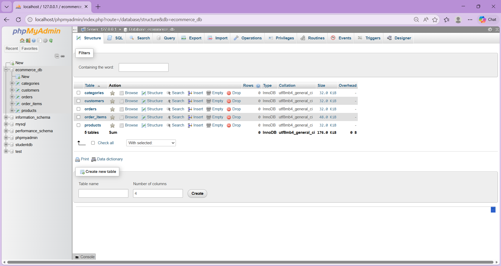
### Category Table 

### Relationship
- One Category has many Products (One-to-Many)

---

## API Endpoints

| Method | Endpoint | Description |
|-------|--------|-------------|
| GET | /api/v1/products | Get all products |
| POST | /api/v1/products | Create product |
| PUT | /api/v1/products/{id} | Update product |
| DELETE | /api/v1/products/{id} | Delete product |

---

## Frontend Integration

The frontend uses Fetch API to dynamically retrieve product data:

async function fetchProducts() {

    try {

        const response = await fetch("http://localhost:8080/api/v1/products");

        // Check response status
        if (!response.ok) {

            if (response.status === 404) {
                throw new Error("Products not found");
            }

            if (response.status === 500) {
                throw new Error("Internal server error");
            }

            throw new Error("Failed to fetch products");
        }

        products = await response.json();

        renderProducts(products);

    } catch (error) {

        console.error("Fetch error:", error.message);

        const productContainer = document.querySelector(".products-grid");

        if (productContainer) {
            productContainer.innerHTML = `
                <h2>${error.message}</h2>
            `;
        }
    }
}

function renderProducts(products) {

    const productContainer = document.querySelector(".products-grid");

    if (!productContainer) return;

    productContainer.innerHTML = "";

    // Empty state
    if (products.length === 0) {

        productContainer.innerHTML = `
            <h2>No products available</h2>
        `;

        return;
    }

    products.forEach(product => {

        const card = document.createElement("article");

        const title = document.createElement("h3");
        title.textContent = product.name;

        const img = document.createElement("img");

        console.log("PRODUCT:',product");
        console.log("IMAGE VALUE:", product.image_url)
        img.src = "images/Minimal-Watch-1.jpg"
        img.alt = product.name;
       

        const price = document.createElement("p");
        price.textContent = "₱" + product.price;
        price.classList.add("price");

        const button = document.createElement("button");
        button.textContent = "Add to Cart";
        button.setAttribute("data-id", product.id);

        card.appendChild(title);
        card.appendChild(img);
        card.appendChild(price);
        card.appendChild(button);

        productContainer.appendChild(card);
    });
}

## Testing

###  Flow Test

* Products are fetched from backend
* Displayed dynamically on page
* The layout adjusts properly for mobile and desktop views.
* 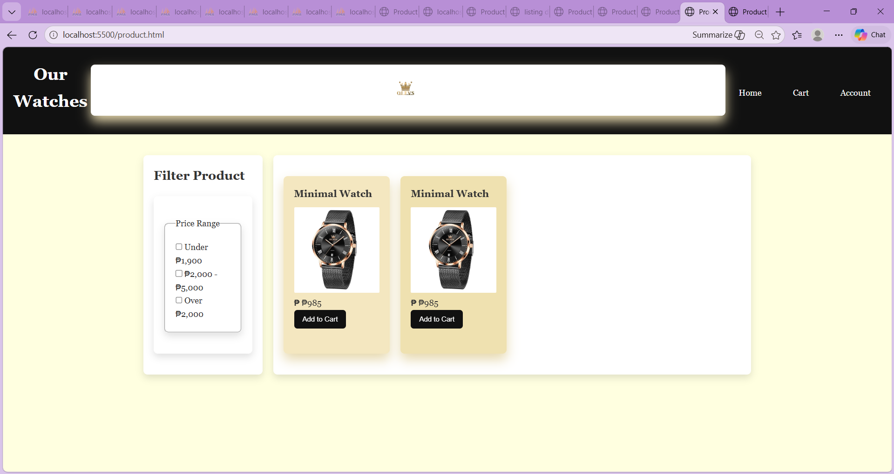

###  Persistence Test

* Data remains after server restart

###  Console Check

* No CORS errors
* No fetch errors
* 

---

## Database 
*Updated Product Table after Testing in Postman
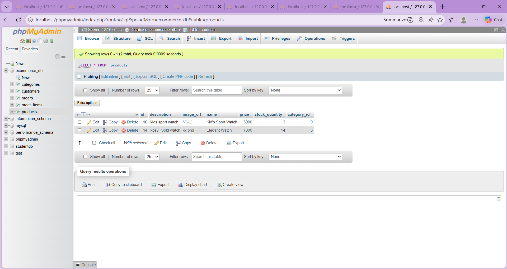

---
## Some Testing in Postman

## For Task 3:

Product Table

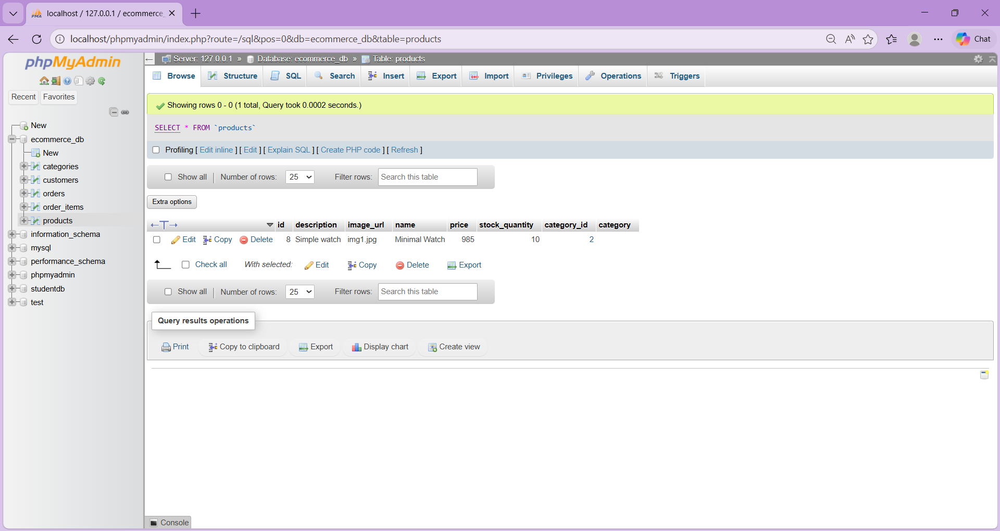

POST method for categories
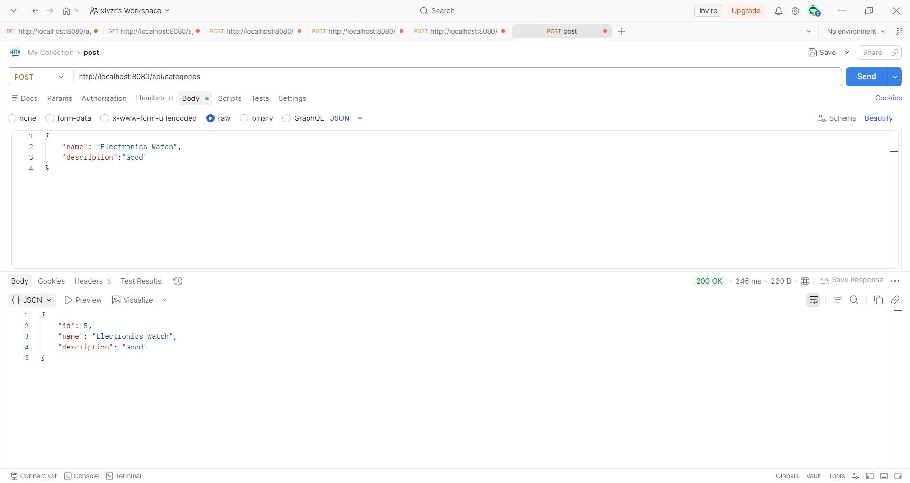

POST method for getting products
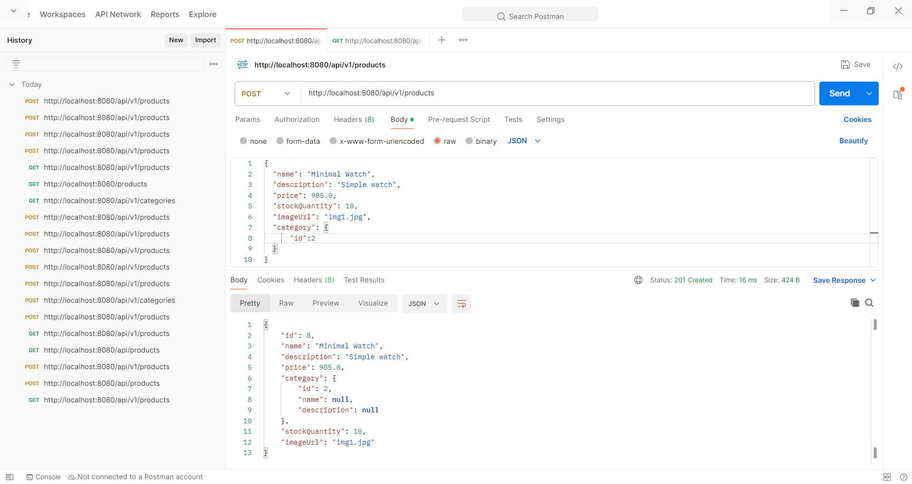

GET method for getiing categories
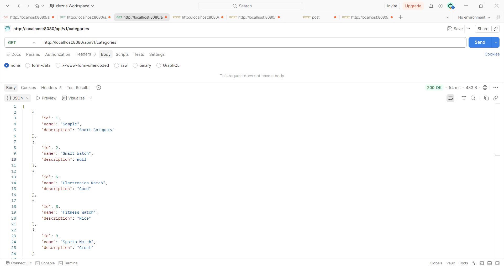

----

## For Task 4:

POST
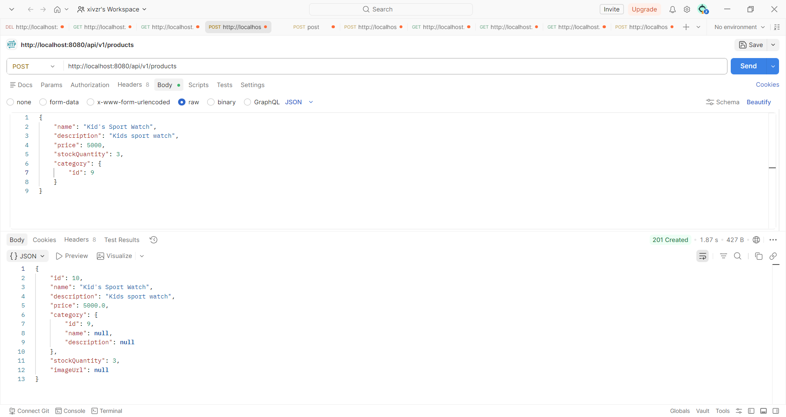

GET PRODUCTS
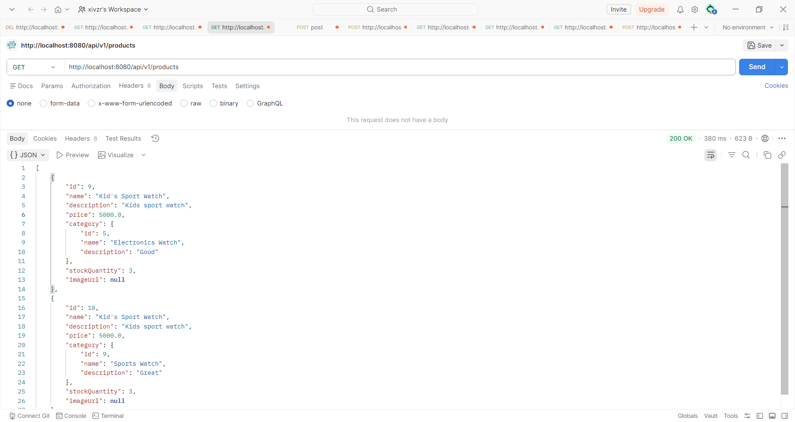

GET AN INVALID ID
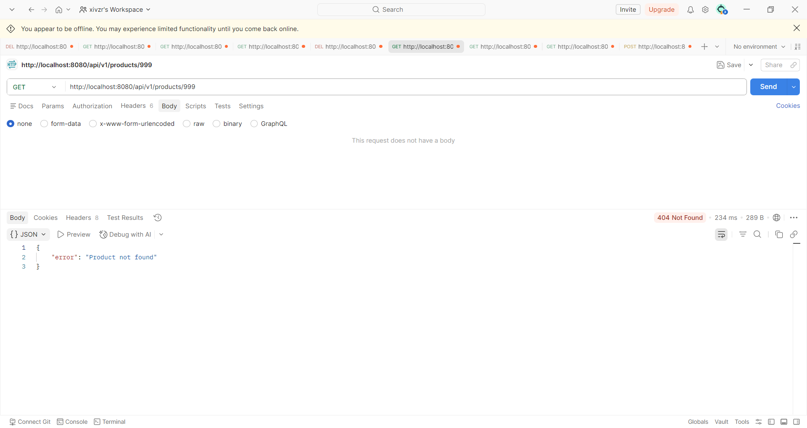

GET VALID ID

PATCH VALID ID
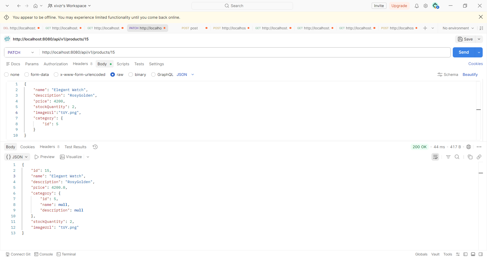

PUT VALID ID
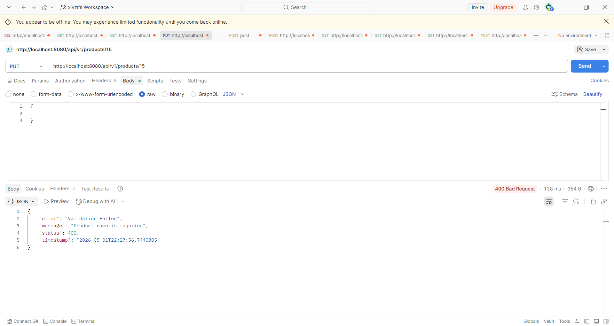

SUCCESSFULLY ADDED IN DATABASE
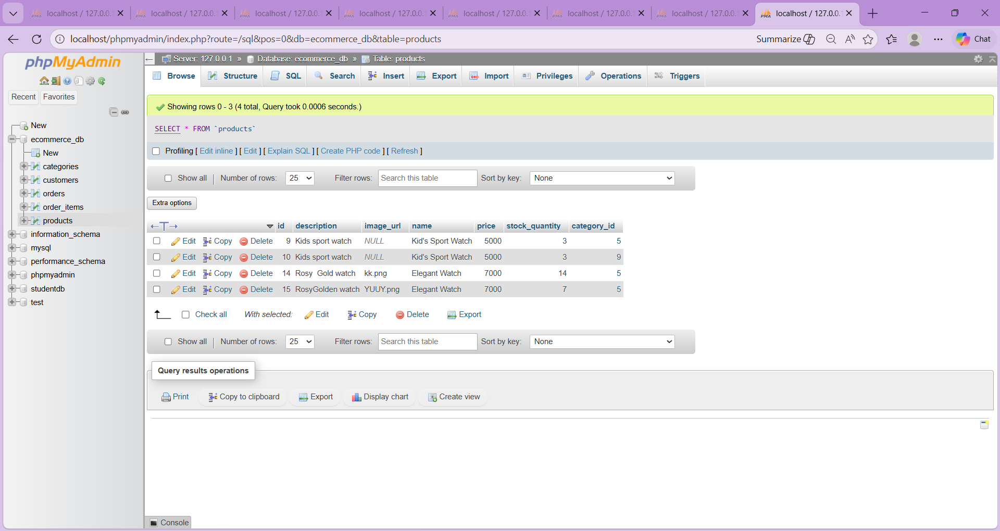

FOR FILTERING
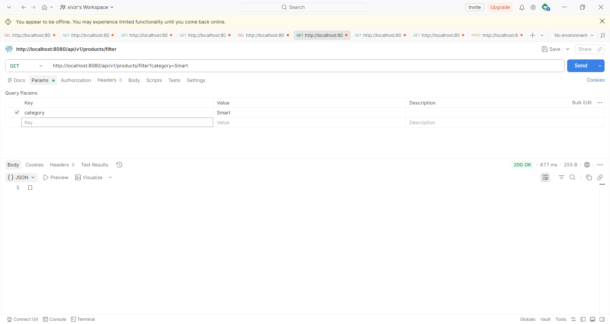

FOR DELETING
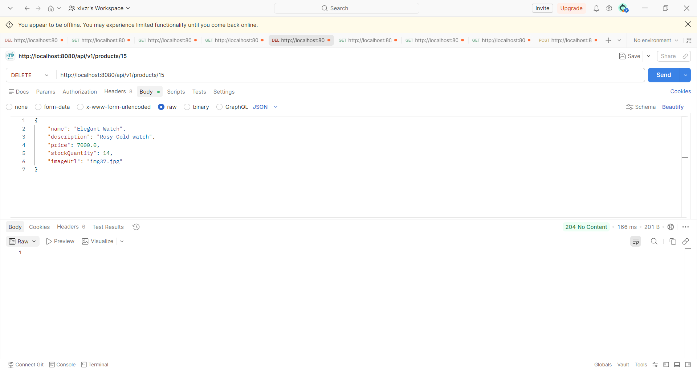

## Author

* Khiara Espelimbergo
* Jhoban Aldrin Fortuna
